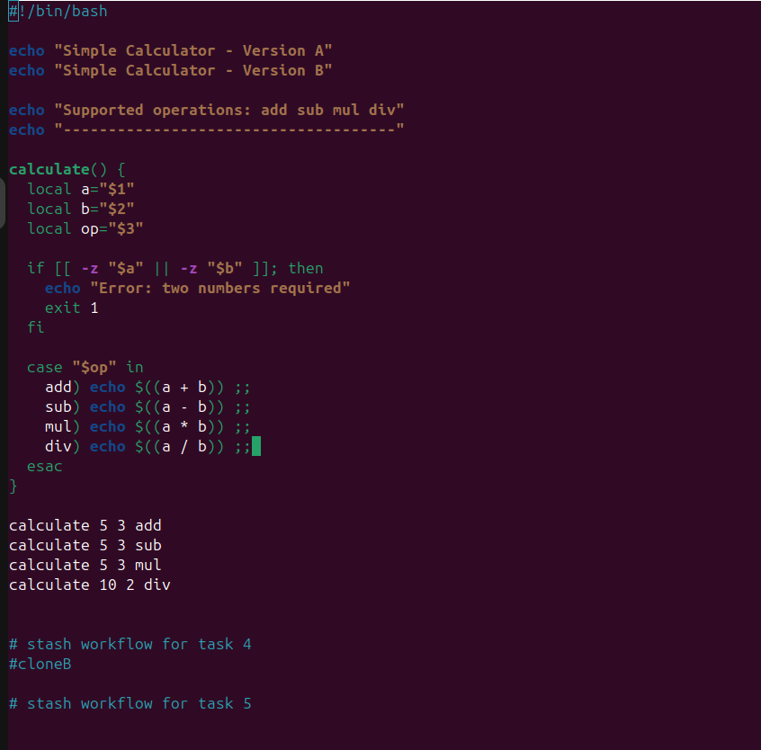
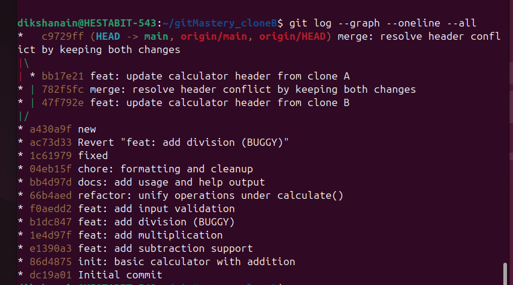

# MERGE POSTMORTEM — TWO CLONES CONFLICT RESOLUTION

## Task Scope
This document covers the task:
**Using two clones of the same repository, edit the same line in the same file, then merge and resolve the conflict while keeping both changes.**

## Setup
Two separate clones were created from the same GitHub repository:
- Clone A
- Clone B

Both clones were initially synchronized with `origin/main`.

## Conflict Creation
The same file, `calculator.sh`, was modified in both clones.

Both clones edited the **same line** responsible for displaying the calculator header, but with different text.

Because the same line was changed differently in two independent commits, Git could not automatically merge the changes.

## Conflict Detection
When one clone attempted to pull changes from the remote repository, Git reported a merge conflict in `calculator.sh`, requiring manual resolution.

## Conflict Resolution
The conflict was resolved manually by editing `calculator.sh` and **keeping both changes** in the final version of the file.

The conflict markers inserted by Git were removed, and both header lines were preserved to ensure no contribution was lost.

## Evidence

### Resolved Source File
The following screenshot shows the final `calculator.sh` file after conflict resolution, with **both conflicting changes retained**:

### Merge Commit History
The following screenshot shows the Git commit graph, including the merge commit created after resolving the conflict:

## Result
- Two clones of the same repository were used
- The same line in the same file was edited
- A merge conflict occurred as expected
- The conflict was resolved manually
- Both changes were preserved
- A merge commit was created successfully
